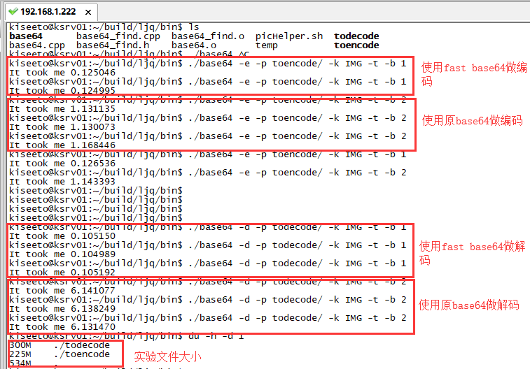

## 实验环境：
* Ubuntu16.04 Server
* 8 Cores / 64G

## 实验目的
对比两个base64库的性能差距

[Fast base64](https://github.com/ReneNyffenegger/cpp-base64)

[之前使用的c++版本base64](https://github.com/aklomp/base64)

## 实验方式
随机选用66张不同的图片，共225MB

## 实验结果

